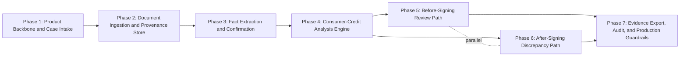

# ROADMAP — nmkgn

> **This is the phase plan.** Phase additions, splits, and reorderings flow through `/gabe-scope-change`. Direct edits flagged by `/gabe-commit` audit.

## 1. Granularity

- **Chosen:** standard (5-8 phases, sprint-sized)
- **Alternatives considered:** coarse (3-5, milestone-sized), fine (8-12, iteration-sized), custom

## 2. Phase Table (at a glance)

| ID | Name | Status | Depends-on | Parallel-with | Covers REQs |
|---|---|---|---|---|---|
| 1 | Product Backbone and Case Intake | complete | — | — | [REQ-01](SCOPE.md#req-01) |
| 2 | Document Ingestion and Provenance Store | complete | 1 | — | [REQ-02](SCOPE.md#req-02), [REQ-04](SCOPE.md#req-04) |
| 3 | Fact Extraction and Confirmation | complete | 2 | — | [REQ-03](SCOPE.md#req-03), [REQ-05](SCOPE.md#req-05) |
| 4 | Consumer-Credit Analysis Engine | complete | 3 | — | [REQ-06](SCOPE.md#req-06), [REQ-07](SCOPE.md#req-07), [REQ-08](SCOPE.md#req-08), [REQ-11](SCOPE.md#req-11) |
| 5 | Before-Signing Review Path | pending | 4 | 6 | [REQ-09](SCOPE.md#req-09) |
| 6 | After-Signing Discrepancy Path | pending | 4 | 5 | [REQ-10](SCOPE.md#req-10) |
| 7 | Evidence Export, Audit, and Production Guardrails | pending | 5, 6 | — | [REQ-12](SCOPE.md#req-12), [REQ-13](SCOPE.md#req-13) |

### Status vocabulary
- **pending** — not started
- **in-progress** — at least one task checked off in per-phase PLAN.md
- **blocked** — dependency or external blocker
- **complete** — all Covers REQs satisfied; validated by `/gabe-align`
- **deferred** — moved out of current roadmap (retained for audit)

### ID conventions
- **Integer IDs** (1, 2, 3, …) are root phases from the initial roadmap.
- **Decimal IDs** (1.1, 2.3, …) are `/gabe-scope-addition` insertions between root phases.

## 3. Phase Detail

Each phase below is deep-linkable via `{#phase-N}` anchor. `/gabe-teach` SCOPE mode surfaces these on demand.

### Phase 1 — Product Backbone and Case Intake {#phase-1}

**Status:** complete
**Goal:** By end of this phase, a user can create a persisted Chilean consumer-credit case through the React app, FastAPI backend, and PostgreSQL database.

**Why (business intent):** The product must begin with the case, not the document. This phase establishes the fixed-field intake, `case_stage` routing, and committed FastAPI/PostgreSQL backbone that every later extraction and analysis step depends on.

**Covers REQs:** [REQ-01](SCOPE.md#req-01)
**Depends-on:** —
**Parallel-with:** —

**Exit criteria:**
- Assigned REQ acceptance signals satisfied
- `/gabe-align` drift check passes
- `/gabe-review` has zero blocking items

---

### Phase 2 — Document Ingestion and Provenance Store {#phase-2}

**Status:** complete
**Goal:** By end of this phase, a user can upload primary and comparison documents and see document status backed by stored metadata and provenance-ready records.

**Why (business intent):** Trust starts before analysis. The app needs a reliable ingestion path, document identity, run state, and storage model before it can make any claim about what the contract says.

**Covers REQs:** [REQ-02](SCOPE.md#req-02), [REQ-04](SCOPE.md#req-04)
**Depends-on:** 1
**Parallel-with:** —

**Exit criteria:**
- Assigned REQ acceptance signals satisfied
- `/gabe-align` drift check passes
- `/gabe-review` has zero blocking items

---

### Phase 3 — Fact Extraction and Confirmation {#phase-3}

**Status:** complete
**Goal:** By end of this phase, a user can inspect extracted high-impact facts with coordinates, dates, provider metadata, confidence, and confirmation controls.

**Why (business intent):** OCR and extraction errors are the fastest way to create false trust. This phase makes source visibility and confirmation a required bridge between documents and findings.

**Covers REQs:** [REQ-03](SCOPE.md#req-03), [REQ-05](SCOPE.md#req-05)
**Depends-on:** 2
**Parallel-with:** —

**Exit criteria:**
- Assigned REQ acceptance signals satisfied
- `/gabe-align` drift check passes
- `/gabe-review` has zero blocking items

---

### Phase 4 — Consumer-Credit Analysis Engine {#phase-4}

**Status:** complete
**Goal:** By end of this phase, the system can generate stable `ConsumerCreditAnalysis` output with deterministic calculations, official references, and fact/inference provenance.

**Why (business intent):** The first document type must work deeply before the product expands. This phase proves the structured-agent contract, calculation layer, official-source catalog, and unsupported-output suppression.

**Covers REQs:** [REQ-06](SCOPE.md#req-06), [REQ-07](SCOPE.md#req-07), [REQ-08](SCOPE.md#req-08), [REQ-11](SCOPE.md#req-11)
**Depends-on:** 3
**Parallel-with:** —

**Exit criteria:**
- Assigned REQ acceptance signals satisfied
- `/gabe-align` drift check passes
- `/gabe-review` has zero blocking items

---

### Phase 5 — Before-Signing Review Path {#phase-5}

**Status:** pending
**Goal:** By end of this phase, a before-signing user can see key terms, bounded market/reference comparisons, missing information, and questions to ask before committing.

**Why (business intent):** Before signing is where comparison and negotiation value is highest. This phase makes the market/reference path useful while preserving the non-marketplace boundary.

**Covers REQs:** [REQ-09](SCOPE.md#req-09)
**Depends-on:** 4
**Parallel-with:** 6

**Exit criteria:**
- Assigned REQ acceptance signals satisfied
- `/gabe-align` drift check passes
- `/gabe-review` has zero blocking items

---

### Phase 6 — After-Signing Discrepancy Path {#phase-6}

**Status:** pending
**Goal:** By end of this phase, an after-signing user can compare the signed contract against offers, simulations, payments, or comparator loans and review discrepancy evidence.

**Why (business intent):** The motivating 60-versus-68-payment case lives here. This phase turns after-the-fact discovery into an evidence-first workflow without telling the user what decision to make.

**Covers REQs:** [REQ-10](SCOPE.md#req-10)
**Depends-on:** 4
**Parallel-with:** 5

**Exit criteria:**
- Assigned REQ acceptance signals satisfied
- `/gabe-align` drift check passes
- `/gabe-review` has zero blocking items

---

### Phase 7 — Evidence Export, Audit, and Production Guardrails {#phase-7}

**Status:** pending
**Goal:** By end of this phase, a user can export or draft communication from selected evidence-backed findings while the system records run audit data and enforces retention guardrails.

**Why (business intent):** The product is only useful if users can act outside it, and only safe if unsupported outputs stay out of exports. This phase closes the loop with evidence-backed drafts, observability, and production readiness rules for sensitive documents.

**Covers REQs:** [REQ-12](SCOPE.md#req-12), [REQ-13](SCOPE.md#req-13)
**Depends-on:** 5, 6
**Parallel-with:** —

**Exit criteria:**
- Assigned REQ acceptance signals satisfied
- `/gabe-align` drift check passes
- `/gabe-review` has zero blocking items

## 4. Dependency Graph

<!-- Auto-generated from Depends-on and Parallel-with columns. Regenerated on any `/gabe-scope-change`. -->

## 5. Coverage Matrix

Every REQ from [SCOPE.md](SCOPE.md#requirements) appears in exactly one phase below. Orphans and duplicates block `/gabe-scope` finalize.

| REQ | Phase |
|---|---|
| [REQ-01](SCOPE.md#req-01) | [Phase 1](#phase-1) |
| [REQ-02](SCOPE.md#req-02) | [Phase 2](#phase-2) |
| [REQ-03](SCOPE.md#req-03) | [Phase 3](#phase-3) |
| [REQ-04](SCOPE.md#req-04) | [Phase 2](#phase-2) |
| [REQ-05](SCOPE.md#req-05) | [Phase 3](#phase-3) |
| [REQ-06](SCOPE.md#req-06) | [Phase 4](#phase-4) |
| [REQ-07](SCOPE.md#req-07) | [Phase 4](#phase-4) |
| [REQ-08](SCOPE.md#req-08) | [Phase 4](#phase-4) |
| [REQ-09](SCOPE.md#req-09) | [Phase 5](#phase-5) |
| [REQ-10](SCOPE.md#req-10) | [Phase 6](#phase-6) |
| [REQ-11](SCOPE.md#req-11) | [Phase 4](#phase-4) |
| [REQ-12](SCOPE.md#req-12) | [Phase 7](#phase-7) |
| [REQ-13](SCOPE.md#req-13) | [Phase 7](#phase-7) |

## 6. Roadmap Change Log

Append-only. Tracks phase splits, merges, insertions, reorderings, and the `/gabe-scope-change` event that caused each.

| Date | Event | Summary |
|---|---|---|
| 2026-05-13 | init | Initial 7-phase roadmap derived from SCOPE.md v1. Granularity: standard. |
| 2026-05-18 | status-sync | Marked Phases 1-3 complete from archived KDBP plans; next planning target remains Phase 4. |
| 2026-05-26 | status-sync | Marked Phase 4 complete from archived KDBP plan (completed_PLAN_2026-05-26_consumer-credit-analysis.md); next targets: Phase 5 and/or 6. |
