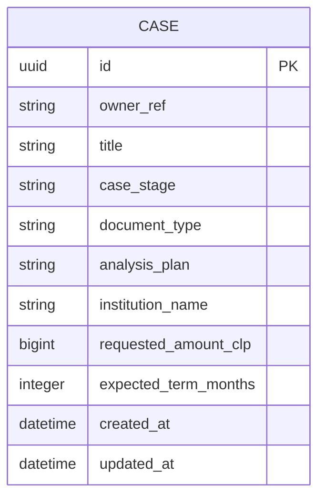

# Architecture

<!-- Standards: see ~/.claude/skills/gabe-docs/SKILL.md (CommonMark + Mermaid + analogy-first) -->

## System Boundary

V0 is a Chilean consumer-credit case reviewer, not a broad legal-document
analyzer. See [V0_ALIGNMENT.md](V0_ALIGNMENT.md) for the product and evidence
rules.

## Committed Stack

- Frontend: React, TypeScript, and Vite.
- Backend: FastAPI.
- Database: PostgreSQL.
- OCR and LLM providers remain behind internal interfaces.

## Data Model

Phase 1 persists the case shell. It intentionally does not persist documents,
OCR output, extracted facts, or agent analysis yet.

Case fields:

- `id`
- `owner_ref`
- `title`
- `case_stage`
- `document_type`
- `analysis_plan`
- `institution_name`
- optional `requested_amount_clp`
- optional `expected_term_months`
- `created_at`
- `updated_at`

Phase 1 constraints:

- `owner_ref` is the fixed stub identity `demo-user`.
- `case_stage` is either `before_signing` or `after_signing`.
- `document_type` is fixed to `consumer_credit`.
- `analysis_plan` is derived from `case_stage` and must match either
  `before_signing_review` or `after_signing_discrepancy`.

Future domain objects:

- Document
- DocumentType
- ExtractedFact
- ProvenanceRecord
- UserConfirmation
- AnalysisRun
- ConsumerCreditAnalysis
- Finding
- Citation
- AnalysisPlan
- NextAction

## API Contracts

Phase 1 exposes a lean case-intake contract:

- Create case request accepts title, stage, institution, optional amount, and
  optional expected term.
- The API owns `owner_ref`, enforces `consumer_credit`, and derives the analysis
  plan from the selected stage.
- Case list and read endpoints only return cases for `demo-user` until real auth
  exists.

The central contract is document-type-specific structured output:

- `ConsumerCreditAgent` returns `ConsumerCreditAnalysis`.
- Future document agents return their own stable analysis models.
- Shared primitives can cover money, dates, source citations, confidence,
  warnings, and next actions.

## API Endpoints

Phase 1 endpoints:

- `GET /api/health`
- `POST /api/cases`
- `GET /api/cases`
- `GET /api/cases/{id}`

## Services

Phase 1 service boundaries:

- SQLAlchemy session management for PostgreSQL.
- Alembic migrations for schema changes.
- Case service for create/list/read operations scoped to the current owner.
- Deterministic stage-to-plan mapping for case intake.

Expected future service boundaries:

- document ingestion and OCR/extraction
- document type detection
- normalized fact confirmation
- document-specific agent analysis
- deterministic calculations
- benchmark and rule-source lookup
- report and email draft generation

## Frontend Structure

Current mockup screens live under `src/screens/` and should be treated as product
flow guidance, not final production implementation.

## Integrations

PostgreSQL is required for application persistence. OCR, LLM provider, document
storage, and benchmark/reference-source strategy are defined behind interfaces
during implementation planning.

Local development ports are registered in [.kdbp/PORTS.md](../.kdbp/PORTS.md)
to avoid collisions with parallel development work.
