# Architecture

<!-- Standards: see ~/.claude/skills/gabe-docs/SKILL.md (CommonMark + Mermaid + analogy-first) -->

## System Boundary

V0 is a Chilean consumer-credit case reviewer, not a broad legal-document
analyzer. See [V0_ALIGNMENT.md](V0_ALIGNMENT.md) for the product and evidence
rules.

## Committed Stack

- Frontend: React, TypeScript, and Vite.
- Backend: FastAPI.
- Database: PostgreSQL.
- OCR and LLM providers remain behind internal interfaces.

## Data Model

The current backend persists the case shell, uploaded document metadata,
extracted text segments, deterministic normalized consumer-credit fact
candidates, and user confirmation records. It still does not run agent
analysis or findings.

```mermaid
erDiagram
  CASE ||--o{ DOCUMENT : owns
  DOCUMENT ||--o{ EXTRACTED_TEXT_SEGMENT : yields
  DOCUMENT ||--o{ CONSUMER_CREDIT_FACT : sources
  EXTRACTED_TEXT_SEGMENT ||--o{ CONSUMER_CREDIT_FACT : anchors
  CONSUMER_CREDIT_FACT ||--o{ FACT_CONFIRMATION : receives

  CASE {
    uuid id PK
    string owner_ref
    string title
    string case_stage
    string document_type
    string analysis_plan
    string institution_name
    bigint requested_amount_clp
    integer expected_term_months
    datetime created_at
    datetime updated_at
  }

  DOCUMENT {
    uuid id PK
    uuid case_id FK
    string owner_ref
    string role
    string document_type
    string original_filename
    string content_type
    integer byte_size
    string checksum_sha256
    string storage_key
    string upload_status
    string extraction_status
    string retention_state
    datetime delete_after
    datetime created_at
    datetime updated_at
  }

  EXTRACTED_TEXT_SEGMENT {
    uuid id PK
    uuid document_id FK
    integer page_number
    integer start_offset
    integer end_offset
    text text
    string extraction_provider
    datetime extracted_at
    float confidence
    string warning_code
    text warning_message
  }

  CONSUMER_CREDIT_FACT {
    uuid id PK
    uuid case_id FK
    uuid document_id FK
    uuid text_segment_id FK
    string fact_key
    string label
    string value_kind
    text value_text
    float value_number
    string value_currency
    date value_date
    string unit
    boolean high_impact
    string confirmation_status
    string source_type
    integer source_page_number
    integer source_start_offset
    integer source_end_offset
    text source_snippet
    string extraction_provider
    datetime extracted_at
    float confidence
    string warning_code
    text warning_message
    datetime created_at
    datetime updated_at
  }

  FACT_CONFIRMATION {
    uuid id PK
    uuid fact_id FK
    string owner_ref
    string action
    text corrected_value_text
    float corrected_value_number
    string corrected_value_currency
    date corrected_value_date
    text note
    datetime created_at
  }
```

Case fields:

- `id`
- `owner_ref`
- `title`
- `case_stage`
- `document_type`
- `analysis_plan`
- `institution_name`
- optional `requested_amount_clp`
- optional `expected_term_months`
- `created_at`
- `updated_at`

Case constraints:

- `owner_ref` is the fixed stub identity `demo-user`.
- `case_stage` is either `before_signing` or `after_signing`.
- `document_type` is fixed to `consumer_credit`.
- `analysis_plan` is derived from `case_stage` and must match either
  `before_signing_review` or `after_signing_discrepancy`.

Document fields:

- `id`
- `case_id`
- `owner_ref`
- `role`: `primary`, `simulation`, `offer`, `payment`, `email`, or
  `comparator_loan`
- `document_type`: fixed to `consumer_credit` for v0
- `original_filename`
- `content_type`
- `byte_size`
- `checksum_sha256`
- `storage_key`
- `upload_status`: `pending`, `stored`, or `failed`
- `extraction_status`: `pending`, `extracting`, `extracted`, `needs_ocr`, or
  `failed`
- `retention_state`: `active`, `delete_requested`, or `deleted`
- optional `delete_after`
- `created_at`
- `updated_at`

Extracted text segment fields:

- `id`
- `document_id`
- optional `page_number`
- optional `start_offset`
- optional `end_offset`
- `text`
- `extraction_provider`
- `extracted_at`
- optional `confidence`
- optional `warning_code`
- optional `warning_message`

Consumer-credit fact fields:

- `id`
- `case_id`
- `document_id`
- optional `text_segment_id`
- `fact_key`: `principal_amount`, `currency`, `contract_date`,
  `term_months`, `payment_count`, `installment_amount`, `interest_rate`,
  `cae`, `total_cost`, `fee`, `insurance`, `linked_product`, or `clause`
- `label`
- `value_kind`: `money`, `currency`, `date`, `integer`, `percentage`, `text`,
  or `boolean`
- optional value columns: `value_text`, `value_number`, `value_currency`,
  `value_date`, and `unit`
- `high_impact`
- `confirmation_status`: `pending`, `confirmed`, `corrected`, or `rejected`
- `source_type`: fixed to `uploaded_document` for the current MVP contract
- optional source locator fields: `source_page_number`, `source_start_offset`,
  `source_end_offset`, and `source_snippet`
- `extraction_provider`
- `extracted_at`
- optional `confidence`
- optional `warning_code`
- optional `warning_message`
- `created_at`
- `updated_at`

Consumer-credit fact constraints:

- A fact must belong to a case and a document.
- An uploaded-document fact must include either a text segment id, a page number,
  or a complete text span.
- Span offsets must be provided as a pair and must be ordered.
- A fact must carry either a normalized value or a warning code explaining why
  the candidate is unresolved.
- `confidence`, when present, is bounded from 0 to 1.

Fact confirmation fields:

- `id`
- `fact_id`
- `owner_ref`
- `action`: `confirm`, `correct`, or `reject`
- optional corrected value columns for correction actions only
- optional `note`
- `created_at`

Fact confirmation constraints:

- `correct` requires at least one corrected value.
- `confirm` and `reject` cannot carry corrected values.
- Confirmation records preserve the user's decision separately from the
  original extraction evidence.

Future domain objects:

- AnalysisRun
- ConsumerCreditAnalysis
- Finding
- Citation
- AnalysisPlan
- NextAction

## API Contracts

The case API exposes a lean case-intake contract:

- Create case request accepts title, stage, institution, optional amount, and
  optional expected term.
- The API owns `owner_ref`, enforces `consumer_credit`, and derives the analysis
  plan from the selected stage.
- Case list and read endpoints only return cases for `demo-user` until real auth
  exists.

The document API scopes uploads under their parent case:

- A document belongs to one case and one owner.
- V0 roles distinguish one primary document from comparison materials such as
  simulations, offers, payments, emails, and comparator loans.
- Upload accepts multipart file + role + document_type; validates content type
  against allowed list, rejects oversized or empty files, and returns full
  document metadata on success.
- Uploaded bytes are addressed by `storage_key`; the API does not publicly
  serve local files.
- Stored uploads run synchronous MVP text extraction. Plain text uploads produce
  span-based segments, text-bearing PDFs produce page-based segments, and
  image or scanned-PDF inputs stay visible as `needs_ocr` instead of silently
  becoming empty evidence.
- For extracted consumer-credit text, the backend runs a deterministic MVP fact
  extractor that stores pending candidates for common high-impact fields such
  as amounts, dates, payment terms, CAE, total cost, fees, insurance signals,
  linked products, and relevant clauses.
- Missing or ambiguous high-impact fields are stored as warning candidates
  instead of invented values.
- A fact candidate is still not a confirmed fact, inference, or finding: it
  must be confirmed, corrected, or rejected before later analysis can treat it
  as trusted input.

The central contract is document-type-specific structured output:

- `ConsumerCreditAgent` returns `ConsumerCreditAnalysis`.
- Future document agents return their own stable analysis models.
- Shared primitives can cover money, dates, source citations, confidence,
  warnings, and next actions.

## API Endpoints

- `GET /api/health`
- `POST /api/cases`
- `GET /api/cases`
- `GET /api/cases/{id}`
- `POST /api/cases/{case_id}/documents` — multipart upload (file + role + document_type)
- `GET /api/cases/{case_id}/documents` — list documents for case, owner-scoped
- `GET /api/cases/{case_id}/documents/{document_id}` — single document metadata
- `GET /api/cases/{case_id}/documents/{document_id}/text-segments` — extracted
  text segments for one owner-scoped document

## Services

Current service boundaries:

- SQLAlchemy session management for PostgreSQL.
- Alembic migrations for schema changes.
- Case service for create/list/read operations scoped to the current owner.
- Deterministic stage-to-plan mapping for case intake.
- Upload storage configuration for local-only document persistence, including
  root path, size limit, allowed content types, retention days, and production
  upload guard.
- Document service for scoped upload, list, and read. Validates content type
  and size, streams file bytes to local storage with SHA-256 checksum, cleans
  up partial files on failure, and enforces owner scoping on all queries.
- Text extraction service for local MVP extraction. It reads stored upload bytes,
  persists extracted segments, marks non-text image/scanned documents as
  `needs_ocr`, marks malformed/unreadable files as `failed`, and hands
  extracted consumer-credit text to the local fact extractor.
- Fact extraction service for deterministic MVP consumer-credit candidates.
  It extracts common high-impact values from stored text segments, preserves
  source segment/page/span/snippet provenance, emits warnings for missing or
  ambiguous fields, and leaves all candidates pending confirmation.
- Fact persistence contract for normalized consumer-credit candidates and
  confirmation records. The schema enforces provenance locator and correction
  boundaries.

Expected future service boundaries:

- OCR provider integration
- document type detection
- OCR/LLM-backed fact extraction
- confirmation API and analysis readiness gate
- document-specific agent analysis
- deterministic calculations
- benchmark and rule-source lookup
- report and email draft generation

## Frontend Structure

Current screens live under `src/screens/`. The case setup and upload steps now
cross the real backend boundary: case setup creates persisted consumer-credit
cases, and upload calls the document API to store files, list document metadata,
and show extracted text segments. Later analysis, plan, finding, and email
screens remain prototype surfaces until normalized facts, confirmations, agents,
and evidence-backed findings exist.

Frontend API helpers live under `src/api/`. `src/api/client.ts` owns the Vite
API base URL, while endpoint-specific clients such as `cases.ts` and
`documents.ts` own request payloads and response types.

## Integrations

PostgreSQL is required for application persistence. OCR, LLM provider, document
storage, and benchmark/reference-source strategy are defined behind interfaces
during implementation planning.

Local upload storage defaults to `var/uploads` and is ignored by git. The
`.env.example` file documents the runtime settings. `NMKGN_ENABLE_PRODUCTION_UPLOADS`
defaults to `false`; accepting real production documents requires auth, malware
scanning, backup/restore, retention/deletion, and audit policy first.

Local development ports are registered in [.kdbp/PORTS.md](../.kdbp/PORTS.md)
to avoid collisions with parallel development work.
