# Architecture

<!-- Standards: see ~/.claude/skills/gabe-docs/SKILL.md (CommonMark + Mermaid + analogy-first) -->

## System Boundary

V0 is a Chilean consumer-credit case reviewer, not a broad legal-document
analyzer. See [V0_ALIGNMENT.md](V0_ALIGNMENT.md) for the product and evidence
rules.

## Committed Stack

- Frontend: React, TypeScript, and Vite.
- Backend: FastAPI.
- Database: PostgreSQL.
- OCR and LLM providers remain behind internal interfaces.

## Data Model

The current backend persists the case shell, uploaded document metadata,
extracted text segments, deterministic normalized consumer-credit fact
candidates, user confirmation records, the receptionist extraction gap gate,
the versioned analysis/finding persistence contract, and the document lifecycle
audit log for retention state transitions and access control events.

```mermaid
erDiagram
  CASE ||--o{ DOCUMENT : owns
  DOCUMENT ||--o{ DOCUMENT_AUDIT_LOG : tracks
  DOCUMENT ||--o{ EXTRACTED_TEXT_SEGMENT : yields
  DOCUMENT ||--o{ CONSUMER_CREDIT_FACT : sources
  DOCUMENT ||--o{ DOCUMENT_RECEPTIONIST_RUN : reviews
  EXTRACTED_TEXT_SEGMENT ||--o{ CONSUMER_CREDIT_FACT : anchors
  CONSUMER_CREDIT_FACT ||--o{ FACT_CONFIRMATION : receives
  DOCUMENT_RECEPTIONIST_RUN ||--o{ DOCUMENT_RECEPTIONIST_OBSERVATION : records
  DOCUMENT_RECEPTIONIST_RUN ||--o{ DOCUMENT_EXTRACTION_GAP : compares
  DOCUMENT_RECEPTIONIST_OBSERVATION ||--o{ DOCUMENT_EXTRACTION_GAP : explains
  DOCUMENT_EXTRACTION_GAP ||--o{ DOCUMENT_EXTRACTION_GAP_RESOLUTION : resolves
  CONSUMER_CREDIT_FACT ||--o{ DOCUMENT_EXTRACTION_GAP : conflicts
  CASE ||--o{ ANALYSIS_RUN : analyzes
  ANALYSIS_RUN ||--o{ ANALYSIS_CALCULATION : computes
  ANALYSIS_RUN ||--o{ ANALYSIS_FINDING : records
  ANALYSIS_RUN ||--o{ UNSUPPORTED_ANALYSIS_OUTPUT : audits
  ANALYSIS_FINDING ||--o{ ANALYSIS_EVIDENCE : cites
  CONSUMER_CREDIT_FACT ||--o{ ANALYSIS_EVIDENCE : supports
  ANALYSIS_CALCULATION ||--o{ ANALYSIS_EVIDENCE : supports

  CASE {
    uuid id PK
    string owner_ref
    string title
    string case_stage
    string document_type
    string analysis_plan
    string institution_name
    bigint requested_amount_clp
    integer expected_term_months
    datetime created_at
    datetime updated_at
  }

  DOCUMENT {
    uuid id PK
    uuid case_id FK
    string owner_ref
    string role
    string document_type
    string original_filename
    string content_type
    integer byte_size
    string checksum_sha256
    string storage_key
    string upload_status
    string extraction_status
    string retention_state
    datetime delete_after
    datetime created_at
    datetime updated_at
  }

  DOCUMENT_AUDIT_LOG {
    uuid id PK
    uuid document_id FK
    string event_type
    string actor_ref
    string from_state
    string to_state
    text detail
    datetime created_at
  }

  EXTRACTED_TEXT_SEGMENT {
    uuid id PK
    uuid document_id FK
    integer page_number
    integer start_offset
    integer end_offset
    text text
    string extraction_provider
    datetime extracted_at
    float confidence
    string warning_code
    text warning_message
  }

  CONSUMER_CREDIT_FACT {
    uuid id PK
    uuid case_id FK
    uuid document_id FK
    uuid text_segment_id FK
    string fact_key
    string label
    string value_kind
    text value_text
    float value_number
    string value_currency
    date value_date
    string unit
    boolean high_impact
    string confirmation_status
    string source_type
    integer source_page_number
    integer source_start_offset
    integer source_end_offset
    text source_snippet
    string extraction_provider
    datetime extracted_at
    float confidence
    string warning_code
    text warning_message
    datetime created_at
    datetime updated_at
  }

  FACT_CONFIRMATION {
    uuid id PK
    uuid fact_id FK
    string owner_ref
    string action
    text corrected_value_text
    float corrected_value_number
    string corrected_value_currency
    date corrected_value_date
    text note
    datetime created_at
  }

  DOCUMENT_RECEPTIONIST_RUN {
    uuid id PK
    uuid case_id FK
    uuid document_id FK
    string owner_ref
    string provider
    string model_name
    string prompt_version
    string schema_version
    string status
    string media_kind
    integer media_page_count
    integer processed_page_count
    boolean partial_coverage
    integer prompt_tokens
    integer completion_tokens
    integer latency_ms
    float cost_usd
    string error_code
    text error_message
    datetime started_at
    datetime completed_at
    datetime created_at
    datetime updated_at
  }

  DOCUMENT_RECEPTIONIST_OBSERVATION {
    uuid id PK
    uuid run_id FK
    uuid case_id FK
    uuid document_id FK
    string fact_key
    string field_label
    string value_kind
    text value_text
    float value_number
    string value_currency
    date value_date
    string unit
    integer source_page_number
    integer source_start_offset
    integer source_end_offset
    text source_snippet
    json bounding_box
    string anchor_status
    float confidence
    json raw_payload
    datetime created_at
  }

  DOCUMENT_EXTRACTION_GAP {
    uuid id PK
    uuid case_id FK
    uuid document_id FK
    uuid run_id FK
    uuid observation_id FK
    uuid fact_id FK
    string fact_key
    string gap_type
    string severity
    boolean blocking
    string status
    text detail
    json deterministic_value
    json receptionist_value
    text source_summary
    datetime created_at
    datetime resolved_at
  }

  DOCUMENT_EXTRACTION_GAP_RESOLUTION {
    uuid id PK
    uuid gap_id FK
    uuid case_id FK
    string owner_ref
    string action
    text note
    uuid created_fact_id FK
    uuid corrected_fact_id FK
    datetime created_at
  }

  ANALYSIS_RUN {
    uuid id PK
    uuid case_id FK
    string owner_ref
    string schema_version
    string status
    json readiness_snapshot
    json input_fact_ids
    string agent_provider
    string model_name
    string prompt_version
    integer prompt_tokens
    integer completion_tokens
    integer latency_ms
    float cost_usd
    text error_message
    json timeline_events
    json warnings
    json suppressed_finding_keys
    datetime started_at
    datetime completed_at
    datetime created_at
    datetime updated_at
  }

  ANALYSIS_CALCULATION {
    uuid id PK
    uuid analysis_run_id FK
    uuid case_id FK
    string calculation_key
    string label
    string formula_version
    json input_fact_ids
    json inputs
    json result
    json missing_input_keys
    datetime created_at
  }

  ANALYSIS_FINDING {
    uuid id PK
    uuid analysis_run_id FK
    uuid case_id FK
    string owner_ref
    string finding_key
    string title
    text summary
    string severity
    string claim_type
    string uncertainty_state
    float confidence
    integer display_order
    datetime created_at
    datetime updated_at
  }

  ANALYSIS_EVIDENCE {
    uuid id PK
    uuid analysis_run_id FK
    uuid case_id FK
    uuid finding_id FK
    string evidence_type
    uuid fact_id FK
    uuid calculation_id FK
    string calculation_key
    string reference_key
    string citation_url
    string citation_label
    datetime citation_retrieved_at
    datetime citation_verified_at
    text excerpt
    text inference_summary
    string model_name
    string schema_version
    datetime created_at
  }

  UNSUPPORTED_ANALYSIS_OUTPUT {
    uuid id PK
    uuid analysis_run_id FK
    uuid case_id FK
    string output_key
    json raw_output
    text reason
    datetime created_at
  }
```

Case fields:

- `id`
- `owner_ref`
- `title`
- `case_stage`
- `document_type`
- `analysis_plan`
- `institution_name`
- optional `requested_amount_clp`
- optional `expected_term_months`
- `created_at`
- `updated_at`

Case constraints:

- `owner_ref` is the fixed stub identity `demo-user`.
- `case_stage` is either `before_signing` or `after_signing`.
- `document_type` is fixed to `consumer_credit`.
- `analysis_plan` is derived from `case_stage` and must match either
  `before_signing_review` or `after_signing_discrepancy`.

Document fields:

- `id`
- `case_id`
- `owner_ref`
- `role`: `primary`, `simulation`, `offer`, `payment`, `email`, or
  `comparator_loan`
- `document_type`: fixed to `consumer_credit` for v0
- `original_filename`
- `content_type`
- `byte_size`
- `checksum_sha256`
- `storage_key`
- `upload_status`: `pending`, `stored`, or `failed`
- `extraction_status`: `pending`, `extracting`, `extracted`, `needs_ocr`, or
  `failed`
- `retention_state`: `active`, `delete_requested`, or `deleted`
- optional `delete_after`
- `created_at`
- `updated_at`

Document retention constraints:

- `retention_state` follows a strict state machine:
  `active` → `delete_requested` → `deleted`. The `delete_requested` state
  can also revert to `active` (cancellation). `deleted` is terminal.
- All retention transitions are enforced at the service layer via
  `VALID_RETENTION_TRANSITIONS` and recorded in `document_audit_log`.
- Deleted documents are excluded from list and get queries by default.
- Owner-scoped access checks at the document level log `access_denied`
  audit events when a non-owner attempts a retention operation.

Document audit log fields:

- `id`
- `document_id`
- `event_type`: `retention_transition`, `access_denied`, or `storage_purged`
- `actor_ref`
- optional `from_state` and `to_state` for retention transitions
- optional `detail`
- `created_at`

Extracted text segment fields:

- `id`
- `document_id`
- optional `page_number`
- optional `start_offset`
- optional `end_offset`
- `text`
- `extraction_provider`
- `extracted_at`
- optional `confidence`
- optional `warning_code`
- optional `warning_message`

Consumer-credit fact fields:

- `id`
- `case_id`
- `document_id`
- optional `text_segment_id`
- `fact_key`: `principal_amount`, `currency`, `contract_date`,
  `term_months`, `payment_count`, `installment_amount`, `interest_rate`,
  `cae`, `total_cost`, `fee`, `insurance`, `linked_product`, or `clause`
- `label`
- `value_kind`: `money`, `currency`, `date`, `integer`, `percentage`, `text`,
  or `boolean`
- optional value columns: `value_text`, `value_number`, `value_currency`,
  `value_date`, and `unit`
- `high_impact`
- `confirmation_status`: `pending`, `confirmed`, `corrected`, or `rejected`
- `source_type`: fixed to `uploaded_document` for the current MVP contract
- optional source locator fields: `source_page_number`, `source_start_offset`,
  `source_end_offset`, and `source_snippet`
- `extraction_provider`
- `extracted_at`
- optional `confidence`
- optional `warning_code`
- optional `warning_message`
- `created_at`
- `updated_at`

Consumer-credit fact constraints:

- A fact must belong to a case and a document.
- An uploaded-document fact must include either a text segment id, a page number,
  or a complete text span.
- Span offsets must be provided as a pair and must be ordered.
- A fact must carry either a normalized value or a warning code explaining why
  the candidate is unresolved.
- `confidence`, when present, is bounded from 0 to 1.

Fact confirmation fields:

- `id`
- `fact_id`
- `owner_ref`
- `action`: `confirm`, `correct`, or `reject`
- optional corrected value columns for correction actions only
- optional `note`
- `created_at`

Fact confirmation constraints:

- `correct` requires at least one corrected value.
- `confirm` and `reject` cannot carry corrected values.
- Confirmation records preserve the user's decision separately from the
  original extraction evidence.

Receptionist run fields:

- `id`
- `case_id`
- `document_id`
- `owner_ref`
- `provider`
- `model_name`
- `prompt_version`
- `schema_version`: starts at `document_receptionist.v1`
- `status`: `pending`, `running`, `completed`, or `failed`
- `media_kind`: `text`, `image`, or `pdf_images`
- optional page counts, partial-coverage flag, token, latency, cost, and error
  metadata
- optional `started_at` and `completed_at`
- `created_at`
- `updated_at`

Receptionist observation fields:

- `id`
- `run_id`
- `case_id`
- `document_id`
- optional `fact_key` for supported fact schema fields
- `field_label`
- `value_kind`: fact value kinds plus `unsupported`
- optional normalized value columns
- optional source locator fields and bounding box
- `anchor_status`: `anchored`, `unanchored`, or `partial`
- optional `confidence`
- JSON `raw_payload`
- `created_at`

Extraction gap fields:

- `id`
- `case_id`
- `document_id`
- `run_id`
- optional `observation_id`
- optional `fact_id`
- optional `fact_key`
- `gap_type`: missing deterministic value, missing receptionist value, value
  conflict, source conflict, deterministic warning resolved by receptionist,
  unanchored receptionist claim, unsupported field, failed receptionist run, or
  partial document coverage
- `severity`: `low`, `medium`, or `high`
- `blocking`
- `status`: `open` or `resolved`
- `detail`
- optional deterministic/receptionist value snapshots and source summary
- `created_at`
- optional `resolved_at`

Gap resolution fields:

- `id`
- `gap_id`
- `case_id`
- `owner_ref`
- `action`: `confirm_deterministic`, `accept_receptionist`,
  `reject_receptionist`, or `defer_unsupported`
- optional `note`
- optional created/corrected fact ids
- `created_at`

Receptionist gate constraints:

- The receptionist receives document media and extracted text, not
  deterministic fact values.
- Receptionist observations are not facts and are not findings.
- A high-impact missing deterministic value, high-impact conflict, source
  conflict, deterministic warning resolved by receptionist, unanchored
  high-impact claim, failed run, or partial-document run blocks composite
  analysis readiness until resolved.
- Accepting a missing known fact creates a new confirmed
  `ConsumerCreditFact` with `extraction_provider="receptionist-agent-v1"`.
- Accepting a conflict corrects the existing deterministic fact through a
  confirmation record. Unsupported fields stay audit/backlog evidence only.

Analysis run fields:

- `id`
- `case_id`
- `owner_ref`
- `schema_version`: starts at `consumer_credit_analysis.v1`
- `status`: `pending`, `running`, `completed`, or `failed`
- JSON snapshots for readiness inputs and fact ids used by the run
- optional provider, model, prompt version, token, latency, cost, and error
  metadata
- JSON `timeline_events`: ordered audit events recorded during the run
  (e.g. `run_started`, `calculations_complete`, `findings_generated`,
  `plan_enrichment_complete`, `run_completed`)
- JSON `warnings`: extraction or calculation warnings emitted during the run
- JSON `suppressed_finding_keys`: finding keys that were evaluated but did not
  fire (no discrepancy or missing calculation)
- optional `started_at` and `completed_at`
- `created_at`
- `updated_at`

Analysis calculation fields:

- `id`
- `analysis_run_id`
- `case_id`
- `calculation_key`
- `label`
- `formula_version`: starts at `consumer_credit_calculations.v1`
- JSON `input_fact_ids`, `inputs`, `result`, and `missing_input_keys`
- `created_at`

Analysis finding fields:

- `id`
- `analysis_run_id`
- `case_id`
- `owner_ref`
- `finding_key`
- `title`
- `summary`
- `severity`: `low`, `medium`, `high`, or `critical`
- `claim_type`: `fact`, `calculation`, `reference`, or `inference`
- `uncertainty_state`: `supported`, `uncertain`, or `missing_context`
- optional `confidence`
- `display_order`
- `created_at`
- `updated_at`

Analysis evidence fields:

- `id`
- `analysis_run_id`
- `case_id`
- `finding_id`
- `evidence_type`: `fact`, `calculation`, `reference`, or `inference`
- optional fact and calculation anchors
- optional reference key, citation URL, citation label, retrieved date, and
  verified date
- optional excerpt, inference summary, model name, and schema version
- `created_at`

Unsupported analysis output fields:

- `id`
- `analysis_run_id`
- `case_id`
- `output_key`
- JSON `raw_output`
- `reason`
- `created_at`

Analysis contract constraints:

- An analysis run is case-scoped and owner-scoped.
- Findings can only use trusted claim types. Unsupported model output cannot be
  stored as a finding.
- Evidence must be anchored by its type: fact id for fact evidence,
  calculation id/key for calculation evidence, citation URL/label for reference
  evidence, and inference summary/model name for inference evidence.
- Unsupported model output is persisted only for audit/debug and is not linked
  into the trusted finding list.

Future domain objects:

- NextAction

## API Contracts

The case API exposes a lean case-intake contract:

- Create case request accepts title, stage, institution, optional amount, and
  optional expected term.
- The API owns `owner_ref`, enforces `consumer_credit`, and derives the analysis
  plan from the selected stage.
- Case list and read endpoints only return cases for `demo-user` until real auth
  exists.

The document API scopes uploads under their parent case:

- A document belongs to one case and one owner.
- V0 roles distinguish one primary document from comparison materials such as
  simulations, offers, payments, emails, and comparator loans.
- Upload accepts multipart file + role + document_type; validates content type
  against allowed list, rejects oversized or empty files, and returns full
  document metadata on success.
- Uploaded bytes are addressed by `storage_key`; the API does not publicly
  serve local files.
- Stored uploads run synchronous MVP text extraction. Plain text uploads produce
  span-based segments, text-bearing PDFs produce page-based segments, and
  image or scanned-PDF inputs stay visible as `needs_ocr` instead of silently
  becoming empty evidence.
- For extracted consumer-credit text, the backend runs a deterministic MVP fact
  extractor that stores pending candidates for common high-impact fields such
  as amounts, dates, payment terms, CAE, total cost, fees, insurance signals,
  linked products, and relevant clauses.
- Missing or ambiguous high-impact fields are stored as warning candidates
  instead of invented values.
- A fact candidate is still not a confirmed fact, inference, or finding: it
  must be confirmed, corrected, or rejected before later analysis can treat it
  as trusted input.

The fact review API exposes the confirmation gate without starting analysis:

- Fact candidate reads are case-scoped and owner-scoped through the source
  document owner.
- Confirmation decisions append a `FactConfirmation` record and update the
  candidate status to `confirmed`, `corrected`, or `rejected`.
- Corrections preserve the original extracted value and store the corrected
  value on the confirmation record.
- Case readiness remains blocked while any high-impact candidate is still
  pending or while a required high-impact fact type has no candidate.

The receptionist API exposes a pre-analysis gap gate:

- Starting a receptionist run is document-scoped and owner-scoped.
- Plain text uses extracted text segments, images pass as image media, and PDFs
  render a bounded number of page images through the media packer.
- The provider adapter returns schema-validated observations or a failed run.
  The default local `fake` provider is deterministic for tests; unconfigured
  providers fail closed.
- Gaps are computed deterministically by comparing receptionist observations
  with deterministic facts. Blocking gaps are explicit and visible.
- Gap resolution is the only path that can promote an observation to a fact or
  correct an existing fact. Unsupported fields can only be deferred/audited.
- `GET /analysis-readiness` composes fact readiness with receptionist readiness.
  The existing `GET /facts/readiness` remains fact-layer readiness only.

The export contract validates user-selected findings before assembly:

- Export accepts a list of finding IDs and resolves them against the latest
  completed analysis run for the case.
- Findings with unsupported claim types (inference) are rejected with an
  explicit reason — REQ-12 requires exports to refuse unsupported outputs.
- Findings without evidence backing are rejected — every exported claim must
  cite at least one source reference.
- Missing finding IDs (not in the latest run) are rejected with a not-found
  reason rather than silently ignored.
- When all requested findings are rejected, the service raises
  `EmptySelectionError` instead of returning an empty export.
- The export summary includes the case ID, run ID, timestamp, exported
  findings with evidence details (fact IDs, calculation keys, reference
  citations), and a separate list of rejected items with per-item reasons.

The central contract is document-type-specific structured output:

- `ConsumerCreditAgent` will return the stable `ConsumerCreditAnalysis` schema.
- Analysis persistence stores versioned runs, calculations, findings, evidence,
  and unsupported outputs before endpoints are exposed.
- Future document agents return their own stable analysis models.
- Shared primitives can cover money, dates, source citations, confidence,
  warnings, and next actions.

## API Endpoints

- `GET /api/health`
- `POST /api/cases`
- `GET /api/cases`
- `GET /api/cases/{id}`
- `POST /api/cases/{case_id}/documents` — multipart upload (file + role + document_type)
- `GET /api/cases/{case_id}/documents` — list documents for case, owner-scoped
- `GET /api/cases/{case_id}/documents/{document_id}` — single document metadata
- `GET /api/cases/{case_id}/documents/{document_id}/text-segments` — extracted
  text segments for one owner-scoped document
- `GET /api/cases/{case_id}/facts` — list owner-scoped consumer-credit fact
  candidates for a case
- `GET /api/cases/{case_id}/facts/readiness` — case-level analysis readiness,
  blockers, required fact keys, unresolved fact ids, and confirmation status
  counts
- `POST /api/cases/{case_id}/facts/{fact_id}/confirmations` — record a
  confirm, correct, or reject decision for one owner-scoped fact
- `POST /api/cases/{case_id}/documents/{document_id}/receptionist-runs` — start
  a receptionist run for one owner-scoped document
- `GET /api/cases/{case_id}/documents/{document_id}/receptionist-runs/{run_id}` —
  read a receptionist run with observations and gaps
- `GET /api/cases/{case_id}/receptionist/gaps` — list case receptionist gaps
- `POST /api/cases/{case_id}/receptionist/gaps/{gap_id}/resolution` — resolve a
  gap and, when allowed, promote/correct facts
- `GET /api/cases/{case_id}/analysis-readiness` — composite fact plus
  receptionist readiness gate
- `GET /api/cases/{case_id}/analysis/runs` — list analysis runs for case,
  newest first
- `POST /api/cases/{case_id}/analysis/runs` — start a new analysis run
  (deterministic or agent-backed, routed by config)
- `GET /api/cases/{case_id}/analysis/runs/{run_id}` — get analysis run with
  nested findings, evidence chains, calculations, and unsupported outputs

## Services

Current service boundaries:

- SQLAlchemy session management for PostgreSQL.
- Alembic migrations for schema changes.
- Case service for create/list/read operations scoped to the current owner.
- Deterministic stage-to-plan mapping for case intake.
- Upload storage configuration for local-only document persistence, including
  root path, size limit, allowed content types, retention days, and production
  upload guard.
- Document service for scoped upload, list, read, and retention lifecycle.
  Validates content type and size, streams file bytes to local storage with
  SHA-256 checksum, cleans up partial files on failure, and enforces owner
  scoping on all queries. Retention operations (`request_deletion`,
  `confirm_deletion`, `cancel_deletion`) enforce the state machine via
  `VALID_RETENTION_TRANSITIONS`, verify document-level ownership (logging
  `access_denied` audit events on mismatch), and record every transition in
  `document_audit_log`. Deleted documents are excluded from list and get
  queries by default (`include_deleted=False`).
- Text extraction service for local MVP extraction. It reads stored upload bytes,
  persists extracted segments, marks non-text image/scanned documents as
  `needs_ocr`, marks malformed/unreadable files as `failed`, and hands
  extracted consumer-credit text to the local fact extractor.
- Fact extraction service for deterministic MVP consumer-credit candidates.
  It extracts common high-impact values from stored text segments, preserves
  source segment/page/span/snippet provenance, emits warnings for missing or
  ambiguous fields, and leaves all candidates pending confirmation.
- Fact review service for owner-scoped candidate listing, confirmation
  decisions, and case readiness. It gates later analysis on all high-impact
  facts being resolved and all required high-impact fact keys having a
  candidate.
- Fact persistence contract for normalized consumer-credit candidates and
  confirmation records. The schema enforces provenance locator and correction
  boundaries.
- Analysis persistence contract for versioned consumer-credit analysis runs,
  deterministic calculation evidence, evidence-backed findings, citation
  metadata, inference metadata, and audit-only unsupported outputs.
- Audit service (`audit.py`): shared pre-analysis setup via
  `prepare_analysis()`, which validates the case, analysis plan, and
  readiness gate, loads confirmed facts, and returns a frozen
  `AnalysisSetup`. Also provides `RunAuditTimeline` for structured
  timeline event recording, per-run warnings, and suppressed finding
  tracking. Error classes (`CaseNotFoundError`, `NotReadyError`,
  `InvalidAnalysisPlanError`, `AgentDisabledError`, `RunNotFoundError`)
  are defined here and re-exported by the analysis module.
- Plan-aware analysis routing foundation: `VALID_ANALYSIS_PLANS` gates
  accepted plan values; `FINDING_SPECS` drives after-signing discrepancy
  checks (3 specs: payment count delta, total paid, term signal) while
  `BEFORE_SIGNING_FINDING_SPECS` drives before-signing key term and
  comparison checks (6 specs: rate comparison, total cost, installment
  ratio, fee summary, insurance review, linked products).
  `_should_fire_finding` unifies both trigger modes (discrepancy key for
  after-signing, any-result for before-signing).
- Before-signing deterministic analysis service (`before_signing.py`):
  attaches reference catalog evidence to before-signing findings via
  `FACT_REFERENCE_MAP` (maps fact keys to official reference keys);
  generates missing-info findings for optional facts not confirmed
  (`interest_rate`, `fee`, `insurance`, `linked_product`) with
  `missing_context` uncertainty state; produces negotiation question
  findings citing reference catalog entries (early payment, mandatory
  insurance, fee breakdown, rate type).
- Receptionist media service for bounded raw-document packing: extracted text
  for text uploads, image media for image uploads, and capped rendered page
  images for PDFs.
- Receptionist provider service for the internal `DocumentReceptionistAgent`
  adapter. The local fake provider is deterministic; unsupported external
  provider names fail closed into run/gap state.
- Receptionist service for run orchestration, observation persistence,
  deterministic gap comparison, human resolution, promotion/correction writes,
  and composite analysis readiness.

- Consumer credit agent settings for env-driven provider selection, model name,
  and timeout configuration via `ConsumerCreditAgentSettings`.
- Consumer credit provider service for the `ConsumerCreditAgent` adapter.
  Provider protocol with factory dispatch: `fake` for deterministic local
  testing, `fake-timeout` for failure-path testing, and fail-closed
  `UnavailableConsumerCreditProvider` for unknown provider names.
- Consumer credit agent analysis orchestration via `run_agent_analysis()`:
  readiness gating, confirmed fact loading, deterministic calculations,
  provider invocation, finding/evidence/unsupported-output persistence,
  run metric recording (latency, tokens, cost), and error capture.
  Path-aware: for `before_signing_review`, the agent receives `analysis_plan`
  in its input and produces `bs_`-prefixed findings with cautious language;
  after persistence, `attach_reference_evidence` enriches calculation-based
  findings with reference catalog citations.
- Before-signing fake provider: generates bounded comparison findings from
  calculation results (rate vs CAE, total cost, installment ratio) using
  cautious B4 language ("vale la pena confirmar"), negotiation question
  findings citing reference keys, and pre-firma summary/next-actions.
  Mirrors the deterministic path's finding shape so the UI can treat both
  analysis modes uniformly.
- Export service (`export.py`) for user-selected finding assembly.
  `export_findings()` loads the latest completed analysis run, validates
  each selected finding ID exists in that run, rejects inference-type
  findings and evidence-less findings with explicit per-item reasons,
  and assembles an `ExportSummary` with finding details and evidence
  references. Raises `EmptySelectionError` when all selections fail
  validation. Owner-scoped via case lookup.

- Draft generation service (`draft.py`) for editable communication drafts
  from exported findings. `generate_draft(ExportSummary)` assembles
  structured `DraftResult` with four sections: Presentación (severity
  breakdown), Hallazgos (numbered findings with missing_context notes),
  Referencias normativas (when reference evidence exists), and Cierre
  (explicit non-advice disclaimer). A deterministic B4 post-filter scans
  all section bodies for 10 prescriptive/advisory patterns (debe,
  recomendamos, fraudulento, etc.) and replaces them with cautious
  alternatives. `filtered_phrases` list tracks every replacement for audit.
  Raises `EmptyExportError` when no findings are provided.

Expected future service boundaries:

- OCR provider integration
- document type detection
- OCR/LLM-backed fact extraction
- benchmark and rule-source lookup

## Frontend Structure

Current screens live under `src/screens/`. The case setup and upload steps now
cross the real backend boundary: case setup creates persisted consumer-credit
cases, and upload calls the document API to store files, list document metadata,
show extracted text segments, list fact candidates, record confirm/correct/reject
decisions, run receptionist review, list/resolve receptionist gaps, and read the
composite readiness gate. The analysis results screen (`AnalysisResults.tsx`) is path-aware: when
`analysisPlan` is `before_signing_review`, findings display in a grouped layout
(questions first, then key term comparisons with inline reference context, then
missing-info as intake prompts) with cautious pre-firma language throughout.
The after-signing discrepancy path mirrors this grouped layout with three
sections: discrepancies first (contract inconsistencies with severity and
reference evidence), then escalation options (SERNAC, detailed statement with
legal citations), then missing comparison documents (simulation/offer as intake
prompts). Post-firma language ("posible inconsistencia", "vias de consulta")
replaces pre-firma language throughout.
Later plan and email screens remain prototype surfaces.

Frontend API helpers live under `src/api/`. `src/api/client.ts` owns the Vite
API base URL, while endpoint-specific clients such as `cases.ts`,
`documents.ts`, `facts.ts`, and `receptionist.ts` own request payloads and
response types.

## Integrations

PostgreSQL is required for application persistence. OCR, LLM provider, document
storage, and benchmark/reference-source strategy are defined behind interfaces
during implementation planning.

Receptionist settings:

- `NMKGN_RECEPTIONIST_ENABLED`
- `NMKGN_RECEPTIONIST_PROVIDER`
- `NMKGN_RECEPTIONIST_MODEL`
- `NMKGN_RECEPTIONIST_MAX_PAGES`
- `NMKGN_RECEPTIONIST_TIMEOUT_SECONDS`

Local upload storage defaults to `var/uploads` and is ignored by git. The
`.env.example` file documents the runtime settings. `NMKGN_ENABLE_PRODUCTION_UPLOADS`
defaults to `false`; accepting real production documents requires auth, malware
scanning, backup/restore, retention/deletion, and audit policy first.

Local development ports are registered in [.kdbp/PORTS.md](../.kdbp/PORTS.md)
to avoid collisions with parallel development work.
