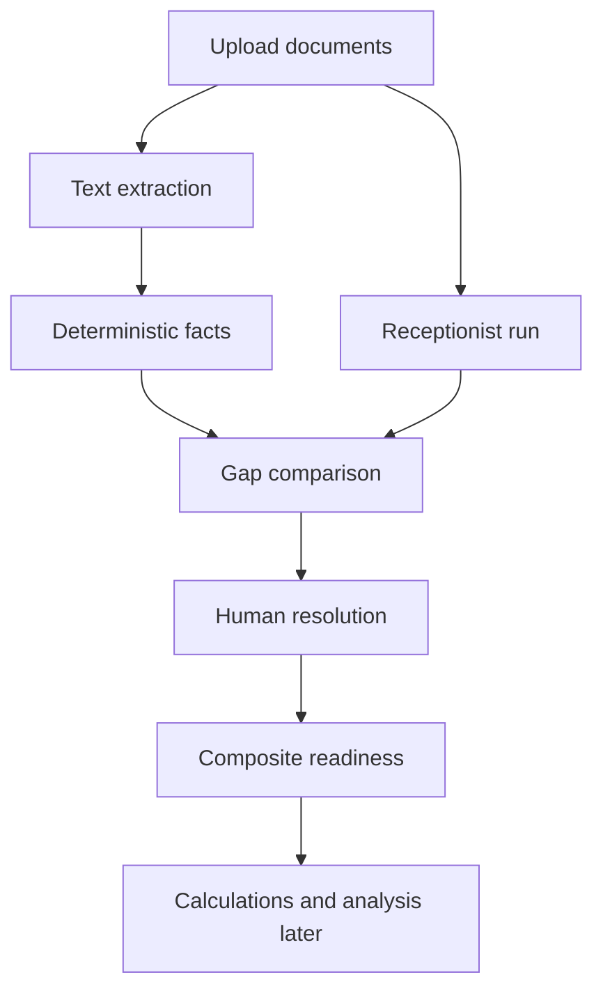

# Base Degradation Scenario

The current local base scenario lives in two ignored upload folders:

- `uploads/credito_edwards_2022/`
- `uploads/credito_scotiabank_2022/`

Each folder includes an `info.json` with the local password material. Keep those
files ignored and do not copy password values into tracked docs, test names, API
transcripts, or screenshots.

## Current Observed Shape

| Local folder | Documents | Observed PDF state |
|---|---:|---|
| `credito_edwards_2022` | 1 PDF | encrypted; current extractor raises `FileNotDecryptedError` without unlock support |
| `credito_scotiabank_2022` | 3 PDFs | not encrypted; 6, 2, and 3 pages |

## Why This Matters

This is our first realistic regression pack. It should help verify the pipeline
as a chain, not just as isolated unit tests:

## Expected Near-Term Use

1. Run both cases through `manual-test-cases/run_catalog.py` for backend
   baselines.
2. Run both cases manually through the UI when the frontend flow is ready.
3. Save API/UI outputs under `runs/<case-id>/<timestamp>/`.
4. Fill the matching expected YAML under `expected/`.
5. Turn stable expectations into automated fixture tests once the behavior is
   understood.

## Latest Backend Baseline

The current in-process runner baseline confirms:

- Edwards: case creation succeeds, the encrypted PDF upload returns HTTP 500,
  no facts are produced, and composite readiness is blocked by missing required
  facts plus a missing receptionist run.
- Scotiabank: all 3 PDFs upload, all 11 pages extract text, 29 deterministic
  facts are produced, 3 receptionist runs complete, 8 gaps remain open, and
  readiness is blocked by unresolved high-impact facts plus unresolved
  receptionist gaps.

## Current Known Pressure Points

- Password-protected PDFs are not unlocked by the current upload/text extraction
  path. The Edwards case currently raises `FileNotDecryptedError` in the local
  extraction helper, so it is the first regression target for fail-closed or
  password-aware extraction.
- The Scotiabank packet should test multi-document sequencing: primary
  contract, payment schedule, summary, deterministic fact coverage,
  receptionist observations, gap resolution, and readiness.
- Any screenshot or transcript saved under `runs/` should be treated as local
  evidence and reviewed before sharing.
